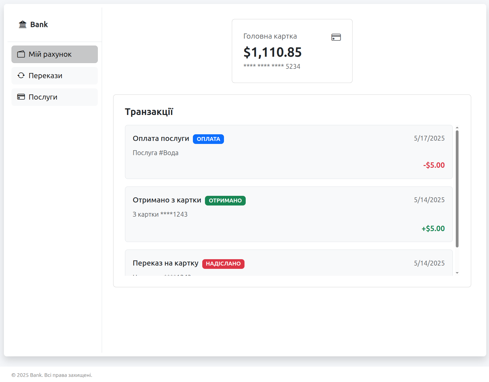

# Web application for remote banking

This course project is dedicated to creating a software application to optimize the activities of a banking enterprise.
The main task is to develop a web application with a graphical interface that interacts with a database to store, update, and process the
necessary information, as well as execute various queries.
